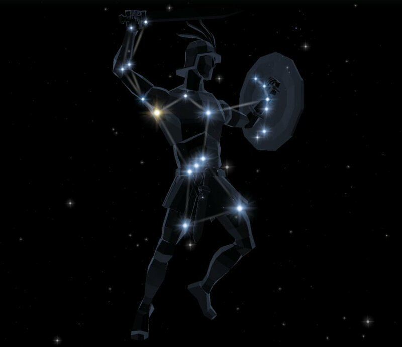
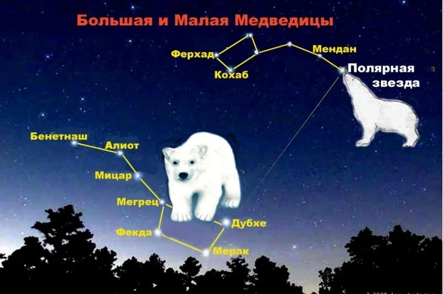
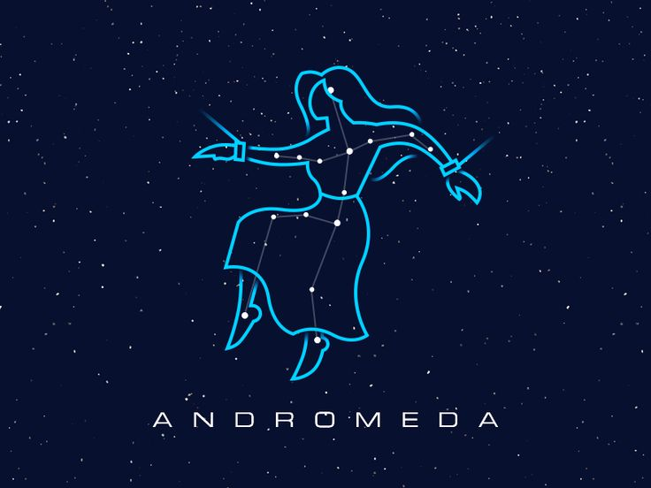
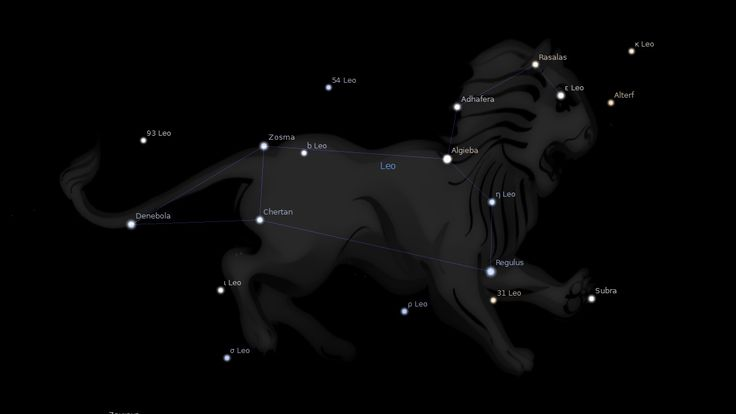
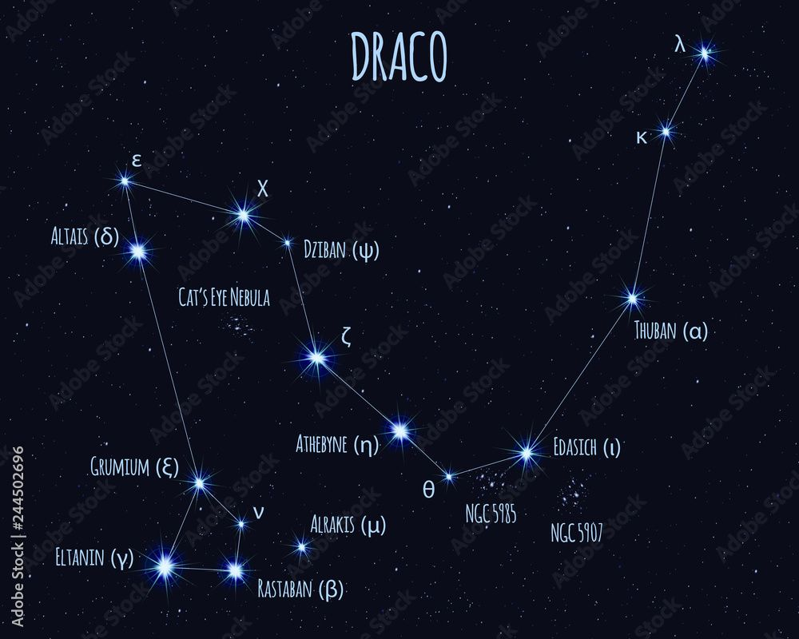
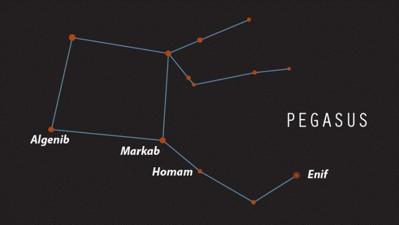
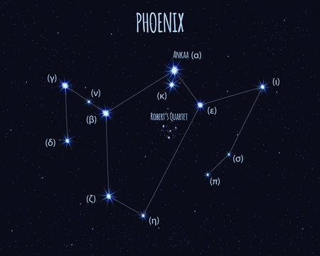

<!DOCTYPE html>
<html lang="ru">
<head>
    <meta charset="UTF-8">
    <meta name="viewport" content="width=device-width, initial-scale=1.0">
    <title>Мифы и легенды о созвездиях</title>
    <meta property="og:title" content="Мифы и легенды о созвездиях">
    <meta property="og:description" content="Увлекательные истории о звёздах и созвездиях">
    <meta property="og:image" content="https://example.com/constellations.jpg">
    <meta property="og:url" content="https://example.com">
    
</head>
<body>
    <header>
        <h1>Мифы и легенды о созвездиях</h1>
    </header>

    

        <h2>Путешествие по ночному небу</h2>
        
Ночное небо всегда завораживало человечество. Сверкающие звезды, таинственные созвездия – они манили своей красотой и загадочностью. С древних времен люди придумывали мифы и легенды, чтобы объяснить этот величественный спектакль. Сегодня мы совершим путешествие по ночному небу, чтобы познакомиться с некоторыми из самых известных и красивых созвездий: могучим Орионом, неутомимыми Медведицами и прекрасной Андромедой.

        

            <h2>Орион: охотник, восставший из пепла мифов</h2>
            
Орион – одно из самых узнаваемых созвездий, его легко найти на зимнем небе. Яркие звезды Бетельгейзе (красный сверхгигант) и Ригель (голубой сверхгигант) образуют его плечи и ноги, а три звезды, образующие пояс Ориона (Альнитак, Альнилам и Минтака), служат отличным ориентиром.

            
            <h3>Мифы и легенды о Орионе:</h3>
            
— Древнегреческая версия: Орион был великим охотником, сыном Посейдона и Эвриалы, сестры Горгон. Он хвастался своей силой и отвагой, за что навлек гнев богини Артемиды. Существует несколько вариантов его смерти: он был убит скорпионом (и тогда созвездие Скорпиона находится на небе напротив Ориона), или Артемида сама убила его, или же он погиб, пытаясь изнасиловать ее. После смерти Орион был вознесен на небо, где продолжил охотиться, но уже среди звезд.

            
— Другие культуры: Мифы об Орионе встречаются в различных культурах. В Египте он ассоциировался с богом Осирисом, а в скандинавской мифологии был известен как охотник, преследующий медведя.

            
            <h3>Помимо мифов:</h3>
            
Орион – созвездие, которое поражает не только своей красотой, но и научным значением. В его пределах находится туманность Ориона – одна из самых ярких и известных туманностей, где активно формируются новые звезды.

        

        

            <h2>Большая и Малая Медведицы: хранительницы небесного круга</h2>
            
Большая Медведица (Ursa Major) – одно из самых больших и известных созвездий, которое легко найти благодаря характерной форме ковша. Малая Медведица (Ursa Minor), в котором находится Полярная звезда (α UMi), менее яркая, но не менее важная.

            

            <h3>Мифы и легенды о Медведицах:</h3>
            
— Древнегреческая версия: Согласно мифу, Большая Медведица – это нимфа Каллисто, возлюбленная Зевса. Ревнивая Гера превратила Каллисто в медведицу. Сын Каллисто, Аркад, встретил ее во время охоты и собирался убить, не узнав мать. Тогда Зевс, чтобы спасти их, превратил Аркада в Малую Медведицу, а Каллисто вознес на небо.

            
— Полярная звезда: Полярная звезда, расположенная в хвосте Малой Медведицы, играет ключевую роль в навигации. Она всегда указывает на север, позволяя ориентироваться путешественникам и мореплавателям с древних времен.

        

        

            <h2>Андромеда: прекрасная принцесса, прикованная к скале</h2>
            
Созвездие Андромеды (Andromeda) находится рядом с созвездием Кассиопеи (мать Андромеды) и Пегаса (крылатый конь). Андромеда известна не только своей красотой, но и наличием галактики Андромеды (M31) – ближайшей к нашей галактике, Млечному Пути.

            

            <h3>Мифы и легенды об Андромеде:</h3>
            
— Древнегреческая версия: Андромеда была дочерью эфиопского царя Кефея и царицы Кассиопеи. Кассиопея похвасталась, что ее красота превосходит красоту нереид (морских нимф), за что боги наслали на страну морское чудовище Кето. Чтобы умилостивить чудовище, Андромеду приковали к скале. Герой Персей, увидев Андромеду, спас ее, убив Кето, и женился на ней. После смерти Андромеда была вознесена на небо.

            
            <h3>Помимо мифов:</h3>
            
Галактика Андромеды (M31) – захватывающее зрелище, которое можно увидеть даже невооруженным глазом в ясную ночь. Она является одним из самых ярких объектов в небе, и ее изучение дает нам ценную информацию о структуре и эволюции галактик.

        

        

    <h2>Лев (Leo)</h2>
    
    
Одно из зодиакальных созвездий, изображающее царя зверей.

    
— Греческий миф: Лев Немейский — чудовище, убитое Гераклом в качестве первого подвига. Его шкура стала неуязвимой броней героя.

    <h2>Дракон (Draco)</h2>
     
    
Извилистое созвездие северного полушария, окружающее Малую Медведицу.

    
— Греческий миф: Дракон Ладон охранял золотые яблоки в саду Гесперид. Был убит Гераклом или усыплен Афиной.

    <h2>Пегас (Pegasus)</h2>
    
    
Крылатый конь из греческой мифологии, чей образ запечатлен на небе.

    
— По легенде, появился из крови Медузы Горгоны, когда Персей отрубил ей голову. Позже стал конем Беллерофонта.

    <h2>Феникс (Phoenix)</h2>
    
    
Созвездие южного полушария, названное в честь мифической птицы.

    
— Египетский миф: Птица Бенну (прообраз Феникса) возрождалась из пепла каждые 500 лет, символизируя цикл смерти и возрождения.

    <h2>Цефей (Cepheus)</h2>
    
    
Созвездие северного полушария, названное в честь эфиопского царя.

    
— Муж Кассиопеи и отец Андромеды. Был вынужден принести дочь в жертву морскому чудовищу, но она была спасена Персеем.

    <h2>Скорпион (Scorpius)</h2>
    
    
Яркое зодиакальное созвездие с красной звездой Антарес.

    
— Греческий миф: Послан Артемидой (или Герой) убить охотника Ориона. На небе расположен так, что будто преследует Ориона.

    <h2>Персей (Perseus)</h2>
    
    
Созвездие северного полушария, названное в честь греческого героя.

    
— Сын Зевса и Данаи. Победил Медузу Горгону, спас Андромеду от морского чудовища. На небе изображен с головой Медузы в руке.

            <h2>В заключение:</h2>
            
Созвездия, такие как Орион, Большая и Малая Медведицы, и Андромеда, – это не просто яркие точки на ночном небе. Это символы, воплощающие в себе древние мифы, легенды и богатую историю человечества. Изучение этих созвездий позволяет нам не только расширить свои знания о космосе, но и приблизиться к пониманию мира, в котором мы живем. Поэтому, отправляясь в путешествие по ночному небу, помните, что каждая звезда – это не только свет, но и история, ждущая своего исследователя.

        

    

    <footer>
        
© 2025 Мифы и легенды о созвездиях | Создано с любовью к звёздам от Агаты

    </footer>
</body>
</html>

<!DOCTYPE html>
<html lang="ru">
<head>
    <meta charset="UTF-8">
    <meta name="viewport" content="width=device-width, initial-scale=1.0">
    <title>Мифы о созвездиях</title>
    
</head>
<body>

    

        <button id="likeButton" class="like-btn">
            ❤
            Нравится
            0
        </button>
        
Спасибо за ваш лайк!

    

    
</body>
</html>

  
